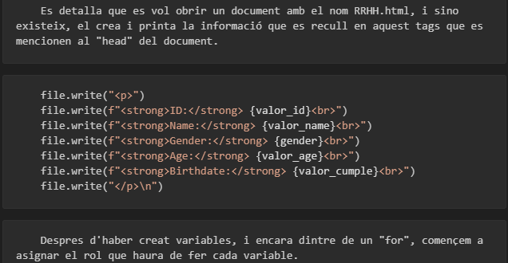

### xml-python
*Laureà Anglada Guisado*

# Documentació DOM amb Python.

[Com fer servir DOM amb Python](https://tutorialmarkdown.com/guia)

## Introducció 

Projecte de creació i desenvolupament de una pagina web amb mecaniques python, xml i html, que es pot utilitzar de guia per a crear documents DOM amb Python


## Detall i explicació 

### Fitxer [punt 1](punt1.py)

En el fitxer, s'import el la llibreria minidom i es comença a crear la base per a extreure informació del "xml" de exemple. 
    -Les principals comandes son:
    doc = minidom.parse ("punt.xml")
    #Aquesta crea el canal i adaptació de la informació. 
    nom_tag_principal=tag_principal.nodeName
    #Aquest seria una variable principal per a poder començar a treballar el document. 

### Fitxer [punt 2](punt2.py)

En aquest punt, ja es comença a tocar petits detalls de programació. On es recullen variables per a poder executarlas d'alguna forma.

    - Les principals comandes en aquest apartat son:

    tag_persona = tag_mostrar.getElementsByTagName("people")[0]

        Aqui ja comença a especificar quins elements del xml treballare.

    tag_name = tag_persona.getElementsByTagName("name")[0]
    valor_name = tag_name.firstChild.data

        En aquest punt, els hi donem una variable amb una definició simple i mes sencilla, per a que sigui més facil d'entre.
    

### Fitxer [punt 3](punt3.py)

Amb el acumulat en els dos punts anteriors, aqui fem una demanda més estricte del "xml", agafant punts exactes del mateix i transformant en una linia de text amb els atributs. 

    -Les comandes necesaries per a poder extreure l'atribut:

    id = tag_people.getAttribute("id")  
    
        D'aquí extreiem la identificació de la persona per a poder tractarla amb python com una variable més.

    print(f"La persona {valor_name} amb DNI {id}.")
    
        Com es pot veure, aqui ens mostraria el nom i el numero previament extret del "xml".
    

### Fitxer [punt 4](punt4.py)

A partir d'aques punt, deixem de fer simples impresions amb python, a directament crear un document propi d'html, amb informació detallada del "xml".

    -Aquí ja es mostren requirements per a gestionar el nou arxiu:
    
    file = open("RRHH.html", "w")
    file.write("<html><head><title>Informació del personal</title></head><body>\n")
    
        Es detalla que es vol obrir un document amb el nom RRHH.html, i sino existeix, el crea i printa la informació que es recull en aquest tags que es mencionen al "head" del document.
```python
    file.write("<p>")
    file.write(f"<strong>ID:</strong> {valor_id}<br>")
    file.write(f"<strong>Name:</strong> {valor_name}<br>")
    file.write(f"<strong>Gender:</strong> {gender}<br>")
    file.write(f"<strong>Age:</strong> {valor_age}<br>")
    file.write(f"<strong>Birthdate:</strong> {valor_cumple}<br>")
    file.write("</p>\n")
``` 
    
        Despres d'haber creat variables, i encara dintre de un "for", començem a asignar el rol que haura de fer cada variable.

    file.write("</body></html>")
    file.close()
    
        I per enllestir, imprimim l'informació dins del documen i tanquem "tag" principals a més de tancar el document, que es creara al mateix directori, a menys que ho indiquem. 

### Fitxer [punt 5]

En aquest punt, crearem un document a més que l'imprimirem per la consola mateixa del visual studio amb un "estil" marcat de html.
    
    -Aquesta vegada necessitarem que variables amb les que donar forma aquesta impresio:
    
    html_doc = minidom.Document()
    html = html_doc.createElement('html')
    html_doc.appendChild(html)

        Com es reflecteix, es va construint els elements carecteristics de un html, com es la propia morfologia.
    
    li_naixement = html_doc.createElement('li')
    li_naixement_text = html_doc.createTextNode(f'neixement - {valor_cumple}')
    li_naixement.appendChild(li_naixement_text)
    ul.appendChild(li_naixement)
    
        Tal com es mostra, estem creant els elements principals que donen forma a un "html".
    
    print(html_doc.toprettyxml())
    
        D'aquesta manere veurem el resultat del document python a la consola, de igual forma que al document.


## Conclusió 

Aquesta documentació pretén proporcionar una guia bàsica sobre com fer servir DOM amb Python per manipular documents XML i HTML de manera eficient.


## Detalls mentre feia el README

Mentres realitzaba la tasca, he estat descobrint detallets que no et diuen les guies ni clases practique peró que poden donar un entendiment millor a l'hora de realitzar aquesta tasca.
### Errors de impresio de codi
Si a un codi que anomenes dins del document, només indiques un sol accent o no tenim enquadrat, el document no trasnmitira els tags i implentara el codi.
file.write("<p>")
    file.write(f"<strong>ID:</strong> {valor_id}<br>")
    file.write(f"<strong>Name:</strong> {valor_name}<br>")
    file.write(f"<strong>Gender:</strong> {gender}<br>")
    file.write(f"<strong>Age:</strong> {valor_age}<br>")
    file.write(f"<strong>Birthdate:</strong> {valor_cumple}<br>")
    file.write("</p>\n")
### Anomenació del codi
Quant estem redactant el text i volem indicar al README que vols fer un codi, et fara un altre requadre diferent, creant separacions poc estiloses.


## Altres temes

### Enllaç del Git
Aqui deixare el enllaç per a poder veure el repertori desde qualsevol lloc del mon o qualsevol tro del bany!
- [Tasca del GitHub](git@github.com:laureangu/xml-python.git)
### Entrega enredadira de la tasca
EL README, ja el tenia quasi tot enfilat perquè ho vaig entregar en una tasca anterior que no era obligatoria. El problema que he tingut ha a sigut volguer buscar la manera de no descarregar rés i volguer pasar per sobre dels rda del shh. 
A més, que tens puntualitzat la perdua de 2 punts per entrega fora de lloc.
